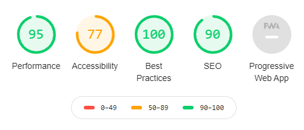
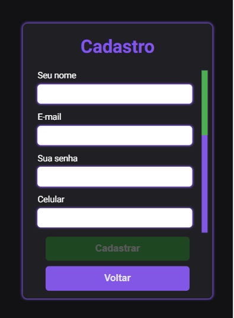
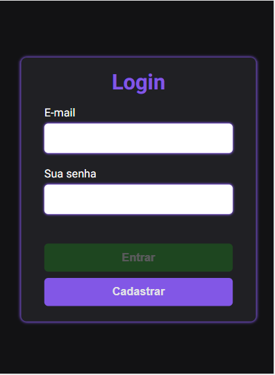
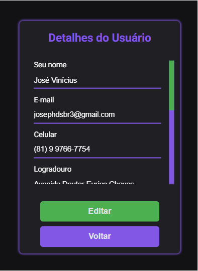

<h1 align="center">CRUD de Usuário - Frontend</h1>
<p>Projeto desenvolvido para ser utilizado no processo de cadastramento, consulta e gerenciamento de usuários.</p>

Tabela de Conteúdos
===================
<p align="center">
    <a href="#informacoes">Informações</a>
    <a href="#features">Features</a>
    <a href="#metricas-e-dados">Métricas e Dados</a>
    <a href="#telas">Telas</a>
    <a href="#pre-requisito">Pré-requisito</a>
    <a href="#instalacao">Instalação</a>
    <a href="#como-usar">Como usar</a>
    <a href="#tecnologias">Tecnologias</a>
    <a href="#autor">Autor</a>
</p>

<h4 align="center">Em Desenvolvimento.</h4>

### Informações

Você pode visualizar esta aplicação através deste [link](https://obscure-hamlet-90064.herokuapp.com/).

### Features

- [x] Configuração da Biblioteca de Gerenciamento de Estado.
- [x] Configuração do Angular Universal para SSR
- [x] Design/Implementação da Tela de Login.
- [x] Design/Implementação da Tela de Cadastro.
- [x] Design/Implementação da Tela de Detalhes do Usuário.
- [x] Design/Implementação da Tela de Atualização de Dados do Usuário.
- [x] Implementação dos Interceptadores e Guards para o tratamento de acesso e requisições
- [x] Implementação dos serviços de acesso a API externas (Backend e Consultar CEP).
- [x] Implementação de Validadores.
- [ ] Implementação de Testes Unitários para os Reducers e Effects.


### [Métricas e Dados](#metricas-e-dados)

As métricas abaixo foram feitas utilizando a ferramenta [LightHouse da Google](https://developers.google.com/web/tools/lighthouse?hl=pt_br).



### Telas

* Cadastro Mobile



* Login Mobile



* Detalhes do Usuário



* Atualização de Dados do Usuário


### [Pré-requisitos](#pre-requisitos)

Antes de começar você vai precisar ter instalado em sua máquina:
- [Angular CLI](https://github.com/angular/angular-cli) na versão 10.2.0.
- Um Package Manager ([NPM](https://www.npmjs.com/) ou [Yarn](https://yarnpkg.com/))
- [Git](https://git-scm.com/)

### [Instalação](#instalacao)

```bash

# Clone do Repositório

$ git clone https://github.com/josephdsbr/user-crud-frontend.git

# Acesse a pasta do projeto no terminal/cmd

$ cd user-crud-frontend

# Instale as dependências

$ npm install ou yarn
```
 
### [Como Usar](#como-usar)

Neste projeto está sendo utilizado o Angular Universal para SSR (Server Side Rendering), de modo que será necessário executar ``npm run dev:ssr`` ou `yarn dev:ssr`
para executar o projeto em modo de desenvolvimento.

### Tecnologias

As seguintes ferramentas foram usadas na construção deste projeto:  

- [Angular Universal](https://angular.io/guide/universal)
- [NGRX](https://ngrx.io/)
- [BEM](http://getbem.com/introduction/)
- [Typescript](https://www.typescriptlang.org/)
- [YUP](https://github.com/jquense/yup)

### Autor
---

<a style="border-radius: 50%;" href="https://github.com/josephdsbr">
 
 <br />
 <sub><b>José Vinícius Santos de Melo</b></sub></a> <a href="https://github.com/josephdsbr" title="Josephdsbr">🚀</a>

Feito com ❤ por José Vinícius 👋🏽 Entre em contato!

* **Instagram** - [@pajebr](https://www.instagram.com/pajebr/)
* **Linkedin** -  [josephdsbr](https://www.linkedin.com/in/josephdsbr)
* **GitHub** - [josephdsbr](https://github.com/josephdsbr)
